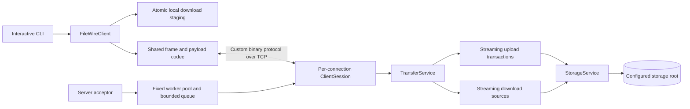
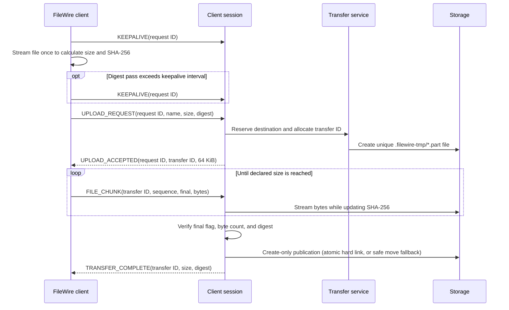
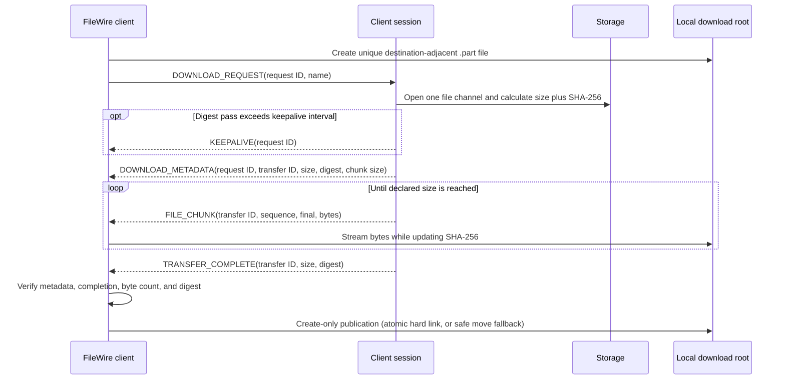

# FileWire

FileWire is a concurrent Java file-transfer system built around a custom length-prefixed binary protocol over TCP. It supports streaming uploads and downloads, safe server-side storage, SHA-256 transfer verification, structured errors, and multiple simultaneous clients.

The project intentionally stays focused: one server, one CLI client, one shared protocol module, and no framework or external runtime dependency. The wire format is FileWire-specific; it is not an implementation of a standardized file-transfer protocol.

## Capabilities

- Upload and download arbitrary binary files without loading complete files into memory
- Handle empty files, exact chunk boundaries, partial final chunks, and embedded zero bytes
- List and delete stored files
- Verify declared size and SHA-256 before an upload or download becomes visible
- Publish verified files with create-only semantics, atomically through hard links when supported
- Reject path traversal, absolute remote names, unsafe local destinations, and symbolic-link escapes
- Serve concurrent connections through a fixed worker pool and bounded queue
- Prevent competing uploads from claiming the same remote filename
- Return typed protocol errors instead of exposing implementation exceptions
- Shut down active sockets, transfers, temporary files, and workers within bounded time

## Architecture



The acceptor only admits as many sockets as the worker pool and queue can hold. Each admitted connection owns an isolated session state machine. Shared state is limited to thread-safe registries for sessions, transfers, upload reservations, and active downloads.

## Repository structure

```text
filewire/
├── pom.xml                       Maven reactor and Java 21 configuration
├── protocol/                     Shared frame model, codecs, limits, and tests
├── server/                       Bounded TCP server, transfers, storage, and tests
├── client/                       Synchronous client, CLI, atomic downloads, and tests
├── server-files/                 Default server storage root
│   └── .gitkeep
├── .github/workflows/build.yml   Java 21 Maven verification
├── .gitignore
├── LICENSE
└── README.md
```

All Java packages are rooted at `filewire`.

## Binary protocol

Every integer is encoded in network byte order (big-endian). A decoder reads and validates the complete 18-byte header before allocating a payload buffer.

| Offset | Size | Field | Validation |
|---:|---:|---|---|
| 0 | 4 bytes | Magic | `0x46574952`, the ASCII bytes `FWIR` |
| 4 | 1 byte | Version | `1` |
| 5 | 1 byte | Message type | Must map to a supported type |
| 6 | 8 bytes | Correlation or transfer ID | Signed `long`, required to be positive |
| 14 | 4 bytes | Payload length | Signed `int`, required to be non-negative and within all applicable limits |
| 18 | Variable | Payload | Strictly decoded according to the message type |

There are no header flags. A file chunk carries its final-chunk marker inside its typed payload.

### Protocol limits

| Item | Limit |
|---|---:|
| Header | 18 bytes |
| Payload | 1 MiB |
| Complete frame | 1 MiB + 18 bytes |
| File chunk data | 64 KiB |
| Remote filename | 255 UTF-8 bytes |
| Success or error text | 1,024 UTF-8 bytes |
| SHA-256 digest | Exactly 32 bytes |
| Directory-list entries | 4,096 |

Strings use a two-byte unsigned byte length followed by strict UTF-8. Invalid UTF-8 is rejected rather than replaced. Decoders also reject negative or inconsistent inner lengths, invalid booleans, trailing payload bytes, unknown enum values, truncated input, and type-specific payloads that exceed their limits.

### Message types

In the payload column, `str` means a two-byte UTF-8 byte length followed by those bytes. `sha256` is exactly 32 bytes.

| Code | Type | Direction | Header ID | Payload |
|---:|---|---|---|---|
| `0x01` | `HELLO` | Client → server | Request ID | Empty; must complete before other operations |
| `0x02` | `LIST_REQUEST` | Client → server | Request ID | Empty |
| `0x03` | `LIST_RESPONSE` | Server → client | Matching request ID | `i32 count`, then `count × str filename` |
| `0x04` | `UPLOAD_REQUEST` | Client → server | Request ID | `str filename`, `i64 size`, `sha256` |
| `0x05` | `UPLOAD_ACCEPTED` | Server → client | Matching request ID | `i64 transferId`, `i32 chunkSize` |
| `0x06` | `DOWNLOAD_REQUEST` | Client → server | Request ID | `str filename` |
| `0x07` | `DOWNLOAD_METADATA` | Server → client | Matching request ID | `i64 transferId`, `str filename`, `i64 size`, `sha256`, `i32 chunkSize` |
| `0x08` | `FILE_CHUNK` | Either transfer sender → receiver | Transfer ID | `i32 sequence`, `u8 final`, `i32 chunkLength`, `chunkLength` bytes |
| `0x09` | `TRANSFER_COMPLETE` | Server → client | Transfer ID | `i64 totalBytes`, `sha256` |
| `0x0A` | `DELETE_REQUEST` | Client → server | Request ID | `str filename` |
| `0x0B` | `SUCCESS` | Server → client | Matching request ID | `str message` |
| `0x0C` | `ERROR` | Server → client | Offending request or transfer ID | `u16 errorCode`, `str message` |
| `0x0D` | `DISCONNECT` | Client → server | Request ID | Empty |
| `0x0E` | `KEEPALIVE` | Either peer during preparation | Current request ID | Empty; one-way activity marker |

Chunk sequences start at zero and must be contiguous. The final flag is exactly `0` or `1`. Because metadata declares the total size, the last full-size chunk can be marked final when a file ends exactly on a chunk boundary. An empty file is represented by one zero-byte final chunk.

The client generates monotonically increasing request IDs per connection. The server assigns transfer IDs from a thread-safe positive sequence. During a long pre-transfer digest pass, the hashing peer sends a one-way `KEEPALIVE` with the current request ID at one-second intervals so the receiver can retain its abandoned-connection read timeout. Custom server read timeouts must be at least twice that interval. FileWire relies on TCP ordering and backpressure, so it does not add redundant per-chunk acknowledgements.

### Error codes

| Code | Name | Meaning |
|---:|---|---|
| 1 | `INVALID_REQUEST` | Request, state, size, or chunk sequence is invalid |
| 2 | `INVALID_FILENAME` | Remote filename or storage target is unsafe |
| 3 | `FILE_NOT_FOUND` | Requested stored file does not exist |
| 4 | `FILE_ALREADY_EXISTS` | A create-only destination already exists |
| 5 | `TRANSFER_CONFLICT` | Session or filename is already involved in a conflicting transfer |
| 6 | `INTEGRITY_MISMATCH` | SHA-256 verification failed |
| 7 | `FRAME_TOO_LARGE` | Declared frame payload exceeds the global limit |
| 8 | `UNSUPPORTED_MESSAGE` | Message type is unknown or invalid in its direction |
| 9 | `MALFORMED_FRAME` | Frame or typed payload is structurally invalid |
| 10 | `INTERNAL_ERROR` | Unexpected server failure |
| 11 | `SERVER_BUSY` | The bounded connection capacity is full |
| 12 | `UNSUPPORTED_VERSION` | Header version is not supported |
| 13 | `TRANSFER_NOT_FOUND` | Transfer ID does not belong to the current active operation |
| 14 | `IO_FAILURE` | Server-side file or socket I/O failed |

A clean EOF before a new header is a normal disconnect. A partial header, partial payload, invalid magic, unsupported version, or malformed typed payload raises a non-recoverable protocol error. The server sends an `ERROR` only when the header supplied a trustworthy positive ID, then closes because the byte stream cannot be safely resynchronized.

## Upload flow



The client rehashes the file while sending it, detecting a source that changes after the metadata pass. The server writes directly to a bounded-buffer temporary stream. Any disconnect, protocol failure, I/O failure, size mismatch, digest mismatch, or shutdown closes the stream, deletes the partial file, and releases the destination reservation.

## Download flow



The server calculates metadata and streams from the same open file channel. The client never truncates the requested destination up front. It deletes its temporary file if the transfer is interrupted or invalid and exposes the destination only after both size and digest match.

## Concurrency and lifecycle

- A dedicated acceptor thread submits sessions to a fixed `ThreadPoolExecutor` backed by an `ArrayBlockingQueue`.
- A fair semaphore caps admitted connections at `workerThreads + queueCapacity`; excess sockets receive `SERVER_BUSY` and close.
- Defaults choose twice the available processors, clamped to 2–16 workers, with a queue twice that size.
- Session IDs and transfer IDs come from independent `AtomicLong`-backed generators that fail instead of wrapping.
- Each connection processes one operation at a time. The client uses an interruptible operation lock, and the server permits only one active transfer per session.
- Each session has its own socket write lock; connections do not share a global output lock.
- Upload reservations use atomic map insertion. Client downloads also reserve normalized local destinations process-wide. Active downloads are counted so a file cannot be deleted during a server-managed download.
- Sockets use a 60-second read timeout by default, TCP no-delay, and operating-system keepalive. Protocol `KEEPALIVE` frames preserve that read deadline during long SHA-256 preparation passes.
- EOF, timeout, malformed input, disconnect, and shutdown converge on idempotent cleanup that unregisters the session and releases its connection permit.
- Shutdown stops acceptance, closes sessions, waits for workers for a configured interval, escalates to interruption if necessary, aborts transfers, and removes incomplete server-side temporary files.

`FileWireServer` is also usable directly in tests or embedding code. `start()` binds before returning, `port()` exposes the assigned port when configured with port `0`, `awaitTermination()` waits for the accept loop, and `close()` is idempotent.

## Storage safety

Remote names are deliberately restricted to portable single path components. Validation rejects null or blank names, `.` and `..`, `/`, `\`, `:`, `<`, `>`, `"`, `|`, `?`, `*`, control characters, trailing spaces or periods, platform-reserved device names, invalid Unicode, and names longer than 255 UTF-8 bytes.

The server adds filesystem checks around that syntax validation:

- The configured root is normalized, created if needed, resolved to a real directory, and rejected if it is a symbolic link.
- Every completed-file target must be a direct child of that root.
- Listing returns sorted regular files with protocol-portable names only, does not follow symbolic links, and hides the repository's `.gitkeep` marker.
- Download and delete require an existing regular non-link file.
- Uploads are staged in the dedicated `.filewire-tmp` directory under the root.
- Temporary files are uniquely created, validated before use, and removed on startup and shutdown.
- Final publication never replaces an existing file. FileWire first creates the final name as a hard link to the verified staging file, which is atomic and create-only on supporting filesystems; it falls back to a move without replacement when links are unavailable.

Client downloads receive the same treatment under a configured download root. Relative and absolute destinations must remain inside that root, existing parent directories may not contain symbolic links, existing destinations and directories are rejected, and incomplete `.part` files are removed.

These controls protect operations performed through FileWire. Administrators should still prevent unrelated processes from modifying the storage directory while transfers are active.

## Requirements

- JDK 21
- Maven 3.9 or newer

The runtime implementation uses only the Java standard library. JUnit 5 is a test dependency.

## Build and test

Run the full reactor verification from the repository root:

```bash
mvn --batch-mode clean verify
```

Useful focused commands are:

```bash
mvn -pl protocol test
mvn -pl server -am test
mvn -pl client -am test
```

GitHub Actions runs `mvn --batch-mode clean verify` with Temurin Java 21 for pushes and pull requests.

## Start the server

Install the reactor artifacts once so module-scoped Maven execution can resolve the shared protocol module:

```bash
mvn --batch-mode clean install
```

Then start the default server on port `7777` with storage in `server-files`:

```bash
mvn -pl server exec:java
```

Override the port and storage directory with positional arguments:

```bash
mvn -pl server exec:java -Dexec.args="9000 ./server-files"
```

The entry point is `filewire.server.FileWireServerMain [port] [storage-directory]`. Passing port `0` asks the operating system for a free port, which the startup message reports.

## Start the client

In another terminal, from the repository root:

```bash
mvn -pl client exec:java
```

The default local download root is `downloads`. Supply a different root as the sole startup argument:

```bash
mvn -pl client exec:java -Dexec.args="./my-downloads"
```

The entry point is `filewire.client.FileWireCli [download-root]`.

## CLI commands

| Command | Behavior |
|---|---|
| `connect <host> <port>` | Open TCP, validate the download root, and complete the automatic `HELLO` handshake |
| `list` | Print the server's sorted completed-file list |
| `upload <local-path> [remote-name]` | Upload a regular non-link file; defaults the remote name to the local basename |
| `download <remote-name> [local-path]` | Download under the configured root; defaults the local path to the remote name |
| `delete <remote-name>` | Delete a completed remote file |
| `disconnect` | Request a graceful server disconnect and close the socket |
| `help` | Print command help |
| `exit` | Close any active connection and leave the CLI |

Example session for a five-byte file containing `hello`:

```text
FileWire client. Type 'help' for commands.
filewire> connect 127.0.0.1 7777
Connected to 127.0.0.1:7777
filewire> upload hello.bin
Uploaded hello.bin (5 bytes, SHA-256 2cf24dba5fb0a30e26e83b2ac5b9e29e1b161e5c1fa7425e73043362938b9824)
filewire> list
hello.bin
filewire> download hello.bin copy.bin
Downloaded hello.bin (5 bytes, SHA-256 2cf24dba5fb0a30e26e83b2ac5b9e29e1b161e5c1fa7425e73043362938b9824)
filewire> delete hello.bin
Deleted hello.bin
filewire> disconnect
Disconnected
filewire> exit
```

Remote failures are printed as `Remote error [CODE]: message`; malformed peer responses are printed as `Protocol error [CODE]: message`. The CLI parser splits on whitespace, so CLI paths containing spaces are not supported.

## Testing strategy

Tests use JUnit 5, loopback sockets, deterministic random data, bounded waits, and `@TempDir` storage rather than shared fixture directories or arbitrary long sleeps.

- Protocol tests round-trip every message type and exercise single-byte fragmentation, concatenated frames, zero-filled binary data, UTF-8 names, clean EOF, bad magic/version/type/IDs, negative and oversized lengths, truncation, invalid flags and inner lengths, invalid UTF-8, trailing bytes, and defensive copying.
- Storage tests cover valid names, traversal and absolute-path rejection, directory targets, regular-file-only listing, missing deletes, startup cleanup, and symbolic-link behavior when the platform permits creating links.
- Upload tests cover 0, 1, 64 KiB − 1, exactly 64 KiB, 64 KiB + 1, exactly two chunks, and multi-chunk partial-tail data, along with wrong digests, wrong sizes, wrong sequences, conflicts, interruption cleanup, and create-only destinations.
- Concurrency and lifecycle tests exercise atomic ID allocation, racing create-only publication, the hard connection limit, structured busy rejection, graceful and abrupt disconnect cleanup, port `0`, start/close races, idempotent close, malformed-frame connection rejection, and interrupted-upload shutdown.
- Client download tests verify create-only commit, process-wide destination reservations, configured size limits, size and digest mismatch cleanup, interruption cleanup, confinement, existing-destination rejection, directory rejection, symbolic-link rejection, post-transfer error handling, and prompt close cancellation of blocked reads.
- The loopback integration test starts the real server on port `0`, transfers boundary-sized and random binary files through the real client, lists them, rejects duplicates, downloads and compares exact bytes, protects existing local files, deletes remote files, checks structured missing-file errors, disconnects, shuts down, and verifies that temporary areas are empty.
- A scripted CLI smoke test executes the documented connect, upload, list, download, delete, disconnect, and exit workflow against a real server and verifies the downloaded binary bytes.

## Design decisions

- **One active operation per client.** This keeps response correlation and cleanup explicit while the server still handles many independent clients concurrently.
- **No chunk acknowledgement layer.** TCP already supplies ordered, reliable delivery and backpressure; FileWire validates sequence, finality, size, and digest at the application boundary.
- **Metadata before bytes.** Upload clients and download servers make a bounded-memory SHA-256 pass before streaming so the receiver knows the expected size and digest before accepting data; one-way preparation keepalives prevent a valid long pass from looking abandoned.
- **Create-only finalization.** A hard-link publication step gives atomic no-overwrite behavior where supported; a non-replacing move is the safe compatibility fallback.
- **Fail closed on malformed framing.** Once a frame boundary is untrustworthy, the connection is closed instead of attempting heuristic resynchronization.
- **Small shared protocol module.** Client and server use the same constants, message codes, strict UTF-8 rules, payload schemas, digest helpers, and filename grammar.

## Limitations

- FileWire stores files on one server-local filesystem; there is no replication or distributed storage.
- There is no authentication, authorization, TLS, or payload encryption. SHA-256 detects corruption but does not authenticate a peer.
- Transfers cannot be resumed, paused, or retried from a partial offset.
- Each client connection performs one operation at a time.
- Remote filenames are single components; remote subdirectories are intentionally unsupported.
- The server upload/download limit and the client's download limit both default to 16 GiB. They are independently configurable through `ServerConfig` and the four-argument `FileWireClient.connect` overload.
- A directory listing must fit one bounded frame and at most 4,096 entries.
- Digest metadata requires an extra read pass before bytes are sent.
- The interactive parser does not support paths containing whitespace.
- Java blocking sockets have no portable write deadline. A peer that stops reading can occupy one bounded server worker until the socket fails or shutdown closes it; connection capacity remains capped.
- Preparation keepalives are emitted between bounded filesystem reads. A single filesystem read that itself stalls beyond the socket deadline can still time out.
- The build produces ordinary module jars rather than a bundled standalone distribution; the documented launch path uses Maven.

## License

FileWire is available under the MIT License. See `LICENSE`.
